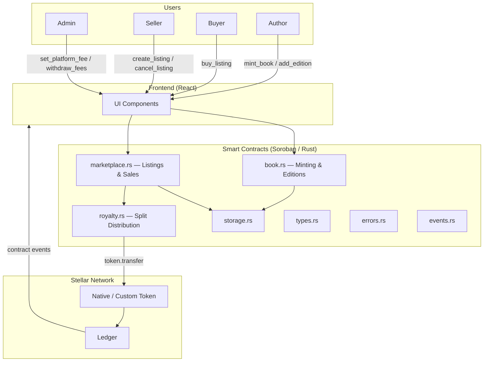
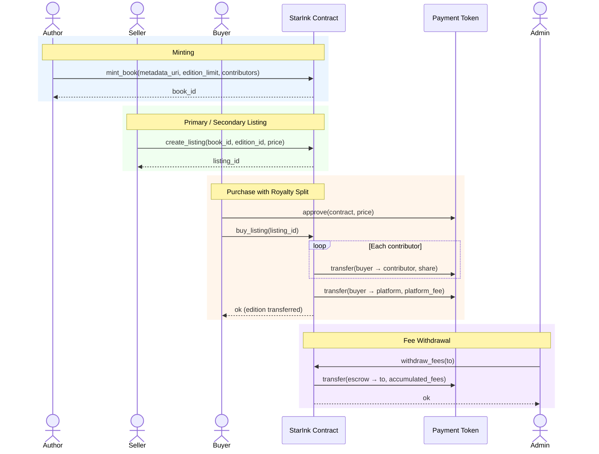

# Star-ink-Contracts

[](https://github.com/yourusername/Star-ink-Contracts/actions/workflows/contract-ci.yml)

Production-ready Soroban smart contracts powering StarInk — a decentralized publishing platform on the Stellar blockchain.

## Overview

StarInk is a decentralized book publishing platform that enables authors to mint books as on-chain assets, receive instant split royalties on every sale, and trade editions on a secondary market. The smart contracts manage the full lifecycle: minting, primary sales, royalty distribution, and peer-to-peer resale.

## Features

- **Book Minting**: Authors mint books as unique on-chain assets with configurable edition sizes
- **Instant Split Royalties**: Royalties are split and distributed atomically at the point of sale — no claiming step required
- **Secondary Market Trading**: Readers can list and trade book editions peer-to-peer with automatic royalty enforcement
- **Contributor Splits**: Multiple contributors (author, illustrator, publisher) can be registered with percentage-based shares
- **Edition Management**: Support for limited and open editions with supply tracking
- **Authorization Security**: Role-based access control for minting and admin operations
- **Event Emission**: Comprehensive event logging for off-chain indexing
- **Admin Controls**: Platform fee management and contract configuration

## Architecture



### Core Components

- **book.rs**: Book minting, edition creation, and supply management
- **marketplace.rs**: Listing creation, purchase execution, and cancellation
- **royalty.rs**: Contributor registration and atomic royalty splitting
- **types.rs**: Shared data structures (`Book`, `Edition`, `Listing`, `Contributor`, `RoyaltySplit`)
- **storage.rs**: Persistent and instance storage helpers
- **errors.rs**: Custom error types
- **events.rs**: Event emission for off-chain indexing
- **test.rs**: Comprehensive test suite

### Storage Model

- **Instance Storage**: Admin, platform fee config, accumulated platform fees
- **Persistent Storage**: Books, editions, listings, contributor splits per book

### Royalty Calculation

Royalties are defined in basis points (bps) per contributor:

- 500 bps = 5% to contributor
- Contributor shares must sum to ≤ 10000 bps (remainder goes to platform)
- Formula: `contributor_payout = sale_price * contributor_bps / 10000`

## Contract Functions

### Administrative Functions

- `initialize(admin, token, platform_fee_bps)` — One-time contract setup
- `update_platform_fee(fee_bps)` — Update platform fee percentage (admin only)
- `withdraw_fees(to)` — Withdraw accumulated platform fees (admin only)

### Author Functions

- `mint_book(author, metadata_uri, edition_limit, contributors)` — Mint a new book with contributor splits (author auth required)
- `add_edition(book_id, edition_limit)` — Add a new edition to an existing book (author auth required)

### Marketplace Functions

- `create_listing(seller, book_id, edition_id, price)` — List a book edition for sale (seller auth required)
- `buy_listing(buyer, listing_id)` — Purchase a listing; royalties distributed atomically (buyer auth required)
- `cancel_listing(seller, listing_id)` — Remove an active listing (seller auth required)

### Query Functions

- `get_book(book_id)` — Retrieve book metadata and contributor splits
- `get_edition(book_id, edition_id)` — Retrieve edition details and remaining supply
- `get_listing(listing_id)` — Retrieve listing details
- `get_platform_fee_bps()` — Current platform fee in basis points
- `get_accumulated_fees()` — Total platform fees collected
- `get_book_count()` — Total number of books minted

## Security Features

1. **Authorization Checks**: Minting and listing operations require proper signer authorization
2. **Supply Enforcement**: Purchases are rejected when edition supply is exhausted
3. **Royalty Integrity**: Contributor bps are validated to not exceed 10000 at mint time
4. **Ownership Validation**: Only the listing creator can cancel their listing
5. **Overflow Protection**: Safe arithmetic throughout fee and royalty calculations

## Testing

The contract includes tests covering:

- ✅ Initialization and configuration
- ✅ Book minting with contributor splits
- ✅ Edition creation and supply tracking
- ✅ Listing creation and cancellation
- ✅ Purchase flow with atomic royalty distribution
- ✅ Platform fee accumulation and withdrawal
- ✅ Authorization enforcement
- ✅ Error conditions (exhausted supply, unauthorized access, invalid splits)
- ✅ Event emission verification

Run tests with:
```bash
cargo test
```

## Quick Start

### 1. Build the Contracts

```bash
cargo build --target wasm32-unknown-unknown --release
stellar contract optimize --wasm target/wasm32-unknown-unknown/release/star_ink.wasm
```

### 2. Deploy to Testnet

```bash
stellar contract deploy \
  --wasm target/wasm32-unknown-unknown/release/star_ink.optimized.wasm \
  --source deployer \
  --network testnet
```

### 3. Initialize

```bash
stellar contract invoke \
  --id <CONTRACT_ID> \
  --source deployer \
  --network testnet \
  -- \
  initialize \
  --admin <ADMIN_ADDRESS> \
  --token <TOKEN_ADDRESS> \
  --platform_fee_bps 250
```

### 4. Mint a Book

```bash
stellar contract invoke \
  --id <CONTRACT_ID> \
  --source author \
  --network testnet \
  -- \
  mint_book \
  --author <AUTHOR_ADDRESS> \
  --metadata_uri "ipfs://Qm..." \
  --edition_limit 500 \
  --contributors '[{"address":"<AUTHOR_ADDRESS>","bps":8000},{"address":"<PUBLISHER_ADDRESS>","bps":1750}]'
```

## Book Sale Lifecycle — Sequence Diagram



## Error Codes

| Code | Error | Description |
|------|-------|-------------|
| 1 | AlreadyInitialized | Contract already initialized |
| 2 | NotInitialized | Contract not initialized |
| 3 | InvalidAmount | Price or amount must be greater than 0 |
| 4 | InvalidFeeBps | Fee must be between 0–10000 bps |
| 5 | InvalidSplitBps | Contributor splits exceed 10000 bps |
| 6 | BookNotFound | Book ID does not exist |
| 7 | EditionNotFound | Edition ID does not exist for this book |
| 8 | ListingNotFound | Listing ID does not exist |
| 9 | EditionSoldOut | Edition supply is exhausted |
| 10 | ListingNotActive | Listing is no longer active |
| 11 | Unauthorized | Caller is not authorized for this operation |
| 12 | NoFeesToWithdraw | No accumulated platform fees available |
| 13 | InvalidMetadataUri | Metadata URI is empty or malformed |
| 14 | Overflow | Arithmetic overflow detected |

## Events

The contract emits events for off-chain indexing:

- `book_minted` — New book minted with contributor splits
- `edition_added` — New edition added to a book
- `listing_created` — Book edition listed for sale
- `listing_sold` — Listing purchased; includes buyer, price, and royalty breakdown
- `listing_cancelled` — Listing removed by seller
- `fee_updated` — Platform fee changed
- `fees_withdrawn` — Platform fees withdrawn by admin

## Dependencies

- `soroban-sdk = "22.0.0"` — Soroban smart contract SDK

## License

MIT

## Support

For issues and questions:
- GitHub Issues: [Create an issue](https://github.com/yourusername/Star-ink-Contracts/issues)
- Stellar Discord: https://discord.gg/stellar

## Contributing

Contributions are welcome!

Quick checklist:
- All tests pass: `cargo test`
- New features include tests
- Documentation is updated
